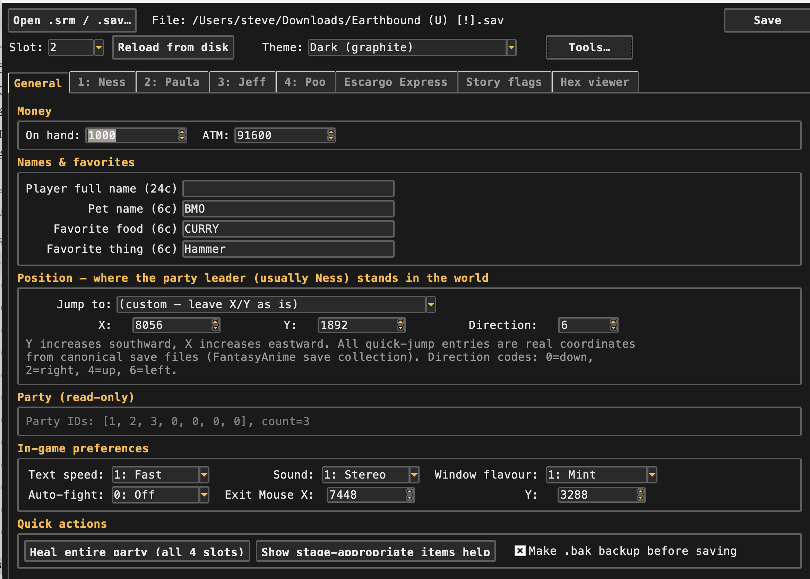
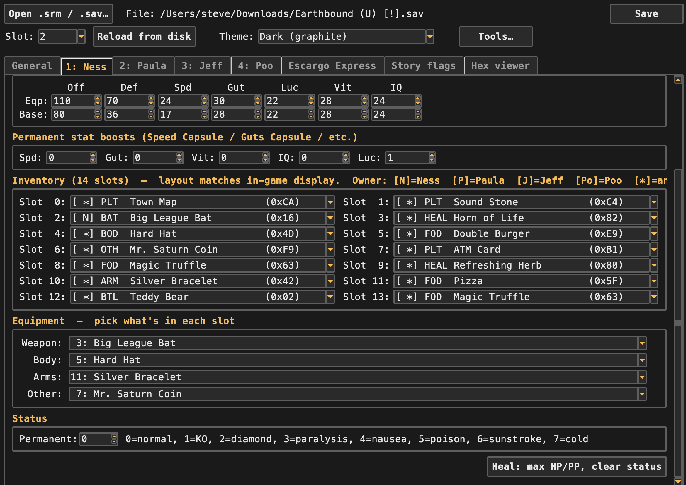
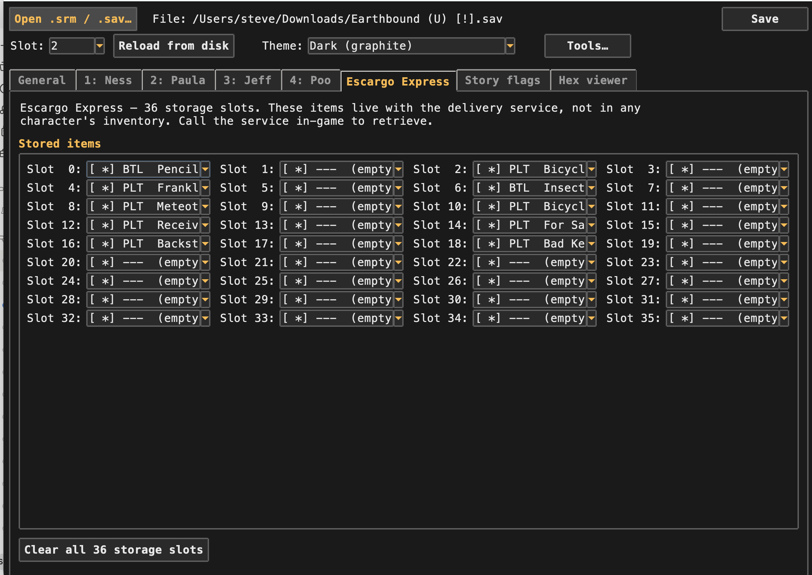
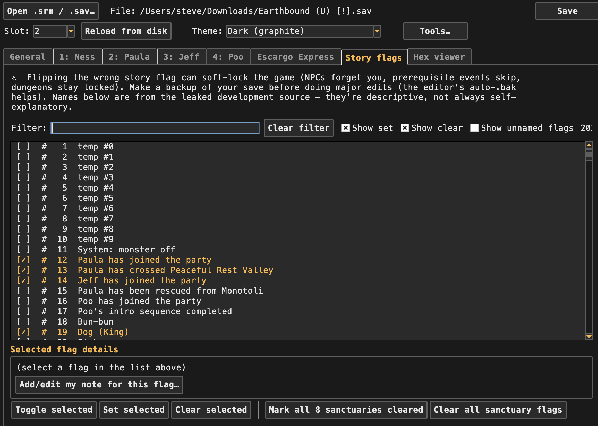
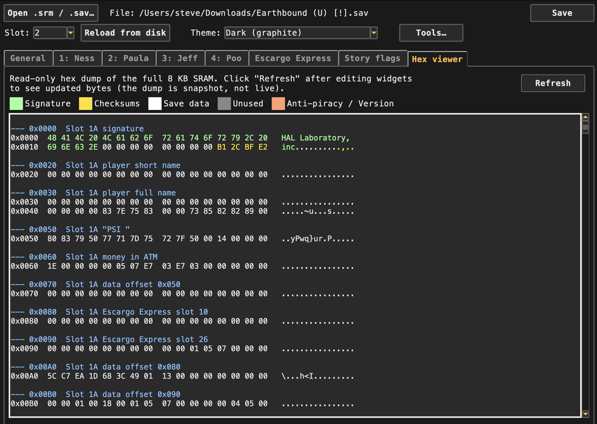

# Oh Mother — EarthBound Save File Editor

> ⚠️ **Experimental.** This tool reads and writes the binary save files
> of EarthBound (SNES, USA region). Always make a backup before editing —
> the editor's auto-`.bak` does it for you, but flipping the wrong byte
> can softlock or corrupt your save. Most byte-level fields here are
> mapped from community reverse-engineering, not official documentation.
> Treat all values as "best effort, please verify in-game."

A standalone tkinter GUI for editing `.srm` / `.sav` save files from
EarthBound. Edit character names, levels, XP, HP, PP, stats, inventory,
equipment, money, position, Escargo Express storage, story flags,
permanent stat boosts, and player preferences (text speed, sound,
window flavour, auto-fight). Both A and B mirror copies of each save
block are updated on save, and both checksums are recomputed.

## Screenshots

**General tab** — money, names & favourites, party-leader position
(with quick-jump presets), in-game preferences, party read-out,
quick-action buttons:



**Character tab** — identity, HP/PP, stats (with-equipment vs. base),
permanent stat boosts, 14 inventory slots with typeahead search,
equipment dropdowns and status:



**Escargo Express** — 36-slot storage editor for the EB delivery
service:



**Story flags** — filterable view over all 1024 plot/event flags,
with curated descriptions, per-flag notes, and a one-click sanctuary
preset:



**Hex viewer** — colour-coded read-only dump of the full 8 KB SRAM
with annotated section headers, useful for reverse-engineering:



## Features

### Character editor (per character: Ness / Paula / Jeff / Poo)
- 5-character name, level (1-99), XP (0-9,999,999) with mid-band optimiser
- Max + current HP and PP
- All 14 stat bytes (with-equipment + base)
- 5 permanent stat boost bytes (Speed / Guts / Vitality / IQ / Luck) —
  cumulative bonuses from in-game capsule items
- 14 inventory slots — categorised dropdown with all 256 EB items, with
  typeahead search and right-click context menu (set empty / copy
  ID / paste ID / move to Escargo / duplicate to all chars)
- 4 equipment slots (Weapon / Body / Arms / Other) — choose by item name,
  with type-mismatch and character-class warnings
- Permanent status (Normal / KO / Diamond / Paralysis / Nausea / Poison /
  Sunstroke / Cold)
- "Heal" button per character; "Heal entire party" on the General tab

### Inventory
- Layout matches EarthBound's in-game order (row by row, left then right)
- Owner code shown for each item:  `[N]` Ness, `[P]` Paula, `[J]` Jeff,
  `[Po]` Poo, `[*]` anyone, `[-]` plot
- Category code:  BAT / FRY / GUN / YOY / SWD / WPN, BOD / ARM / OTH armor,
  FOD / HEAL / BTL / PLT / BRK / MSC
- Type / ownership warnings when you save (food in a weapon slot, frypan
  on Ness, etc.)

### General tab
- Money on hand + ATM balance
- Player full name, pet name, favourite food, favourite thing
- X / Y / direction with **35 confirmed quick-jump locations** drawn from
  the FantasyAnime canonical save collection — every chapter milestone
  has a real, verified coordinate
- Party readout (read-only)
- In-game preferences:  text speed, sound mode, window flavour,
  auto-fight, Exit Mouse coordinates
- "Heal entire party" + "Show stage-appropriate items help"
- Diagnostic line:  anti-piracy byte (0x1FF0) + region/version word
  (0x1FFE) — flags non-US or odd-cart saves immediately

### Escargo Express tab
- All 36 storage slots in a 4-column grid
- Same item dropdown as inventory
- "Clear all 36" button

### Story flags tab
- All 1024 flags in a searchable, scrollable list
- 721 flags have source-code names (mirrored from Datacrystal /
  Catador's CCScript port of Mr. Lindblom's leaked dev files)
- About 30 of the most important flags have curated human-readable
  descriptions verified against the FantasyAnime save collection —
  sanctuary boss kills, party joins, phone availability, etc.
- The other 690+ flags get an auto-translated description from the
  `FLG_REGION_X_SUFFIX` source-code naming (DSRT=Dusty Dunes,
  POLA=Paula, GLOBAL=Global; suffixes _APPEAR / _DISAPPEAR / _CLEAR /
  _GONE / _GOT etc.)
- Filter by name, description, flag number, or your own notes
- Hide / show set / clear / unnamed flags
- Click → Space / Enter / double-click toggles
- Two presets:  "Mark all 8 sanctuaries cleared" and "Clear all
  sanctuary flags"
- Selected flag details panel shows raw `FLG_*` name, byte/bit, and
  any user notes
- Add your own note for any flag — saved to `~/.eb_save_editor.json`,
  searchable, displays alongside the auto-description

### Hex viewer tab
- Read-only colour-coded hex dump of the full 8 KB SRAM
- Section headers between blocks (signature, checksums, save data,
  unused, anti-piracy / version)
- User-labelled bytes (from save-diff) annotated inline
- Refresh after widget edits to see updated bytes

### Tools menu
- **Copy slot…** — snapshot the current slot into another slot before
  risky edits.  Both A and B mirrors are copied; checksums recomputed.
- **Import character from another save…** — pull one character entry
  (95 bytes) from a different `.srm` into the active slot.
- **Compare with another save (diff)…** — interactive diff that lists
  every differing byte with section labels and bit-level deltas.
  Label rows ("PSI Rockin α learned", "Paula was kidnapped", etc.) —
  labels persist to settings JSON and surface in future diffs and
  the hex viewer.  Export to a text file to share findings.
- **Bulk inventory fill…** — five presets (party healing, boss prep,
  Jeff battle gadgets, Escargo rares, clear all).

### Quality-of-life
- **6 themes** including Dark (default), Plain (EB purple/yellow),
  Strawberry, Mint, Banana, Gingham (blue/green checker), Light.
  Persists between launches.
- **Settings persistence** — last open file, last directory, last
  selected slot, recent files, theme, window geometry.
- **Recent files** submenu in File menu (up to 10).
- **Tab validation badges** — any tab with issues gets a `⚠ N`
  suffix in its title.
- **Save flash** — bright green status bar pulse on successful save.
- **Cmd+1…7 / Ctrl+1…7** keyboard shortcuts to switch tabs.
- **Tooltips** on the most useful fields (money, stat boosts, etc.)
- **Backup-on-save** — writes a `.bak` of the previous file before
  overwriting.
- **Auto-reopens last file** on launch.
- **Scrollable tabs** — General, character, and Escargo tabs scroll
  vertically when the window is shorter than their content, so the
  bottom rows stay reachable on smaller laptop displays. Mousewheel
  binding is scoped per-tab so Notebook tab clicks stay snappy.
- **Toolbar shortcut to Tools** — the Tools menu is also available
  as an inline toolbar button so you don't have to chase the macOS
  menu bar.

## Running

Three ways to use it — pick whichever fits.

### A — prebuilt Mac app (easiest, no Python needed)

Grab the signed + notarised `.app` from the
[Releases](https://github.com/clickysteve/Oh-Mother-Earthbound-Save-File-Editor/releases)
page, drag it to Applications, double-click. No Gatekeeper warning,
no `xattr` workaround — Apple's notary service has already stamped
it.

The bundle is built with PyInstaller from `eb_save_gui.py`, signed
with a Developer ID Application certificate, notarised, and stapled.
Build instructions for maintainers are in [BUILDING.md](BUILDING.md).

### B — prebuilt Windows .exe (no Python needed)

Grab `Oh Mother.exe` from the same
[Releases](https://github.com/clickysteve/Oh-Mother-Earthbound-Save-File-Editor/releases)
page. Single self-contained binary; just double-click to run.

The Windows build is **unsigned** — first time you launch it, Windows
SmartScreen will say "Windows protected your PC". Click
**More info → Run anyway**. After the first launch it stops nagging.

The `.exe` is built automatically by the
[`.github/workflows/release.yml`](.github/workflows/release.yml) GitHub
Actions workflow on every tag push. PyInstaller can't cross-compile,
so this is the simplest path if you don't have a Windows machine.

### C — run the Python script (Mac / Windows / Linux)

Requires:

- **Python 3.8+** with **tkinter** — ships with most Python
  distributions
- No third-party packages

If `python3 -c "import tkinter"` works without error, you're good.

```bash
git clone https://github.com/clickysteve/Oh-Mother-Earthbound-Save-File-Editor.git
cd Oh-Mother-Earthbound-Save-File-Editor
python3 eb_save_gui.py
```

If `import tkinter` fails:

| OS | Fix |
|---|---|
| macOS (Homebrew Python) | `brew install python-tk@3.12` |
| Ubuntu / Debian | `sudo apt install python3-tk` |
| Fedora / RHEL | `sudo dnf install python3-tkinter` |
| Windows | Re-run the python.org installer with "tcl/tk and IDLE" checked |

> macOS note: Apple's bundled `/usr/bin/python3` has tkinter, but it
> links against the deprecated system Tk 8.5, which renders the editor
> with washed-out widget styling on modern macOS. Either Homebrew's
> `python@3.12 + python-tk@3.12` or the python.org universal2
> installer give you a modern Tk 8.6/9.x and look correct. (This same
> issue is why the build script for the Mac `.app` refuses to use
> `/usr/bin/python3` — see BUILDING.md for the full story.)

Pick **File → Open .srm / .sav…** or click the "Open .srm / .sav…"
button on the toolbar to load a save.

EarthBound saves usually live here:

| Emulator | Save location |
|---|---|
| RetroArch (Snes9x core) | `~/Library/Application Support/RetroArch/saves/` (Mac), `~/.config/retroarch/saves/` (Linux), `%APPDATA%\RetroArch\saves\` (Windows) |
| Snes9x | next to the ROM, `.srm` extension |
| OpenEmu | `~/Library/Application Support/OpenEmu/SNES/Saves/` |
| BSNES / bsnes-plus | next to the ROM, `.srm` |

Both `.srm` and `.sav` work — they're the same byte format, just
different filename conventions used by different emulators.

## How the format works

The 8 KB SRAM dump contains 6 blocks (3 saves × 2 mirror copies):

```
0x0000  Slot 1A: signature + checksums + 0x4E0 bytes of save data
0x0500  Slot 1B: mirror copy of slot 1
0x0A00  Slot 2A: signature + checksums + 0x4E0 bytes of save data
0x0F00  Slot 2B: mirror copy of slot 2
0x1300  Slot 3A
0x1800  Slot 3B
0x1FF0  Anti-piracy byte (must be 0x31)
0x1FFE  Region/version word (0x0493 for US)
```

Each block starts with `"HAL Laboratory, inc."` as a 20-byte signature,
then `Checksum 1` (sum of all data bytes mod 0x10000) and `Checksum 2`
(XOR of all 16-bit little-endian words). The game refuses to load a
block whose checksum doesn't match.

The save data section is a mirror of the WRAM persistent-data block at
`0x97F5` in RAM. Top-of-block fields are player name, pet name,
favourites, money, position, party list. At `0x56` is the 36-byte
Escargo Express storage. At `0x1D9` starts the 6-entry character stats
table (95 bytes per entry; 4 main characters + 2 reserved). At `0x413`
is the 1024-bit story flag table.

For the gory details:
- https://datacrystal.tcrf.net/wiki/EarthBound/SRAM_map
- https://datacrystal.tcrf.net/wiki/EarthBound/Character_stats_table
- https://datacrystal.tcrf.net/wiki/EarthBound/Flags
- Item ID list:  https://gamefaqs.gamespot.com/snes/588301-earthbound/faqs/80925
- XP curves:  https://shrines.rpgclassics.com/snes/eb/experience.shtml
- Canonical saves at every story milestone:  https://fantasyanime.com/legacy/earthb_saves.htm

## Caveats

- **Story-flag editing is risky.** Flipping the wrong flag can soft-lock
  the game (NPCs forget you, prerequisite events skip, dungeons stay
  locked). Auto-`.bak` runs before every save so you can always roll
  back. Test changes in a duplicate save first.
- **PSI / "learned moves" editing isn't implemented.** The 14-byte
  "unknown" region in each character entry is suspected to be the
  per-character PSI-learned bit table, but bit→PSI mapping isn't
  publicly documented anywhere I could find. Use the save-diff tool
  to map bits empirically.
- **Equipment-applied stats are stored values, not computed.** The
  game only recomputes them when you equip something in-game. If
  you change inventory but the on-screen stats look off, equip any
  item once in-game to refresh.
- **Item IDs come from a community FAQ**, not extracted from your
  ROM. Patched / hacked copies may have different IDs.
- **Most non-trivial edits will appear right away in your save file**,
  but if the game's already loaded a slot in RAM, you'll need to
  reload it from the in-game menu before changes take effect. Or just
  restart the emulator.

## Settings file

Per-user preferences live in `~/.eb_save_editor.json`:

```json
{
  "theme": "Dark (graphite)",
  "window_geometry": "1100x820",
  "last_file": "/Users/you/saves/Earthbound (U) [!].srm",
  "last_dir": "/Users/you/saves",
  "last_slot": 2,
  "recent_files": ["..."],
  "user_byte_labels": { "0x05CD": "PSI Rockin α (Ness)" },
  "user_flag_notes": { "421": "Threed cemetery zombies cleared" }
}
```

Delete the file to reset to defaults. Safe to hand-edit.

## Reverse-engineering workflow

For figuring out undocumented flags, PSI bits, and other unknown
regions, the editor has a **save-diff tool** that's purpose-built for
this:

1. In-game, save before doing the action you want to investigate (e.g.
   learning a new PSI move at level-up, defeating a specific boss).
2. Do the action and save again to a different slot or duplicate the
   `.srm`.
3. In the editor, open one save and run **Tools → Compare with another
   save** against the other.
4. The diff dialog lists every differing byte with section labels and
   bit-level deltas.  Filter by section / character / flag table to
   narrow down.
5. **"Label selected row(s)…"** records what you've learned —
   persisted to settings, shown in future diffs and the hex viewer.
6. **"Export diff to text file…"** for sharing or contributing back
   to the editor's curated `FLAG_DESCRIPTIONS` dict.

Ten or twenty before-after pairs from well-chosen save points and the
PSI / flag map starts filling in.

## Contributing

PRs welcome. High-impact directions:

- **Fill in the curated `FLAG_DESCRIPTIONS` dict.** Every flag you
  identify with the diff workflow makes the Story Flags tab more
  useful.
- **Map the PSI-learned bits.** The 14-byte 0x35-0x42 region in each
  character entry — if you can identify which bit lights when which
  PSI move is learned, we can build a real PSI editor.
- **Localised item names.** This editor uses USA item names from the
  GameFAQs item list. Japanese (Mother 2) names would be a separate
  table.
- **Map IDs / coordinates.** The 35 quick-jump locations are
  confirmed-real but only cover one canonical save per chapter. More
  granular spots inside each town would be useful.

## License

MIT — see [LICENSE](LICENSE).

## Acknowledgements

- HAL Laboratory and Itoi Shigesato for EarthBound
- The Datacrystal wiki for the SRAM/RAM/character-entry format
- 3vrB257A5gq3fg on GameFAQs for the canonical item ID list
- RPGClassics for the per-character XP threshold tables
- Catador & the PK Hack discord for the CCScript-converted flag names
- FantasyAnime.com for the canonical save collection at every chapter
- The EB ROM-hacking community in general — every relevant byte was
  found by someone who didn't have to share their notes but did anyway.
